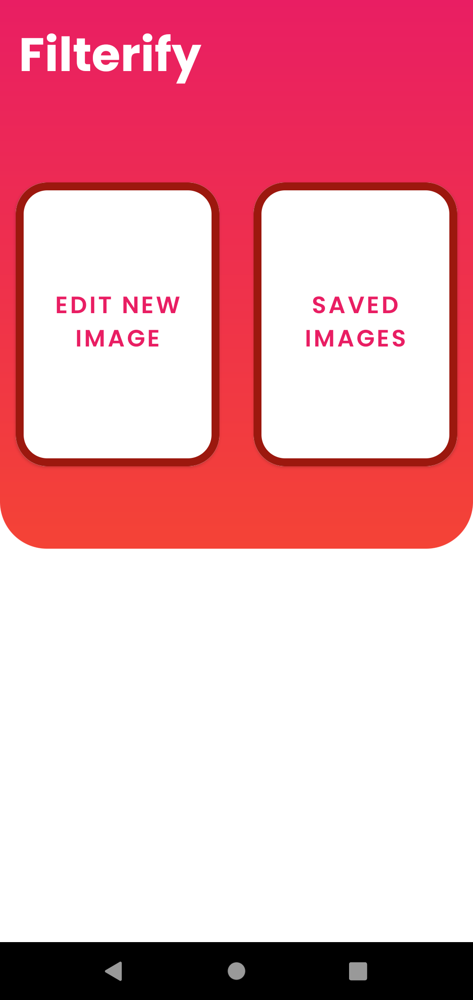

# Filterify

This project is basically setting filters to photos and it's built using the `MVVM Architecture`, for dependency injection used `Koin`. The filters are implemented using `GPUImage`.

### Screenshots

  
  

  
  

